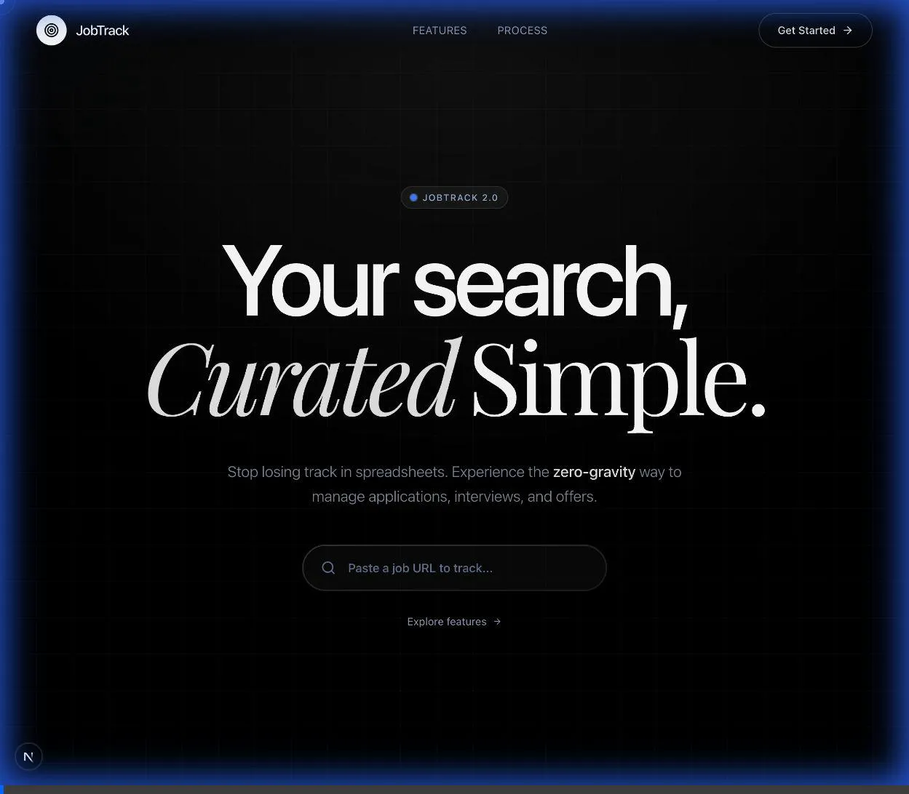

<div align="center">
  <br />

  <a href="https://github.com/unisone/jobtrack-portfolio" target="_blank">
    
  </a>
  <a href="https://jobtrack-portfolio.vercel.app/" target="_blank">
    
  </a>

  <br />

  <h1 align="center">JobTrack Portfolio</h1>

  <p align="center">
    <strong>A modern job application tracking platform with premium glassmorphic UI</strong>
  </p>

  <div align="center">
    
    
    
    
    
  </div>

  <br />

  <div align="center">
    
    
    
    
    
  </div>

</div>

<br />

<div align="center">
  
</div>

<br />

---

## Table of Contents

- [What It Does](#what-it-does)
- [The Showcase](#the-showcase)
- [The Engineering Behind the UI](#the-engineering-behind-the-ui)
- [Tech Stack](#tech-stack)
- [Getting Started](#getting-started)
- [Project Structure](#project-structure)
- [Testing](#testing)
- [License](#license)

---

---

## 🚀 Live Demo

[**Check out the live site here**](https://jobtrack-portfolio.vercel.app/)

> [!TIP]
> **Frictionless Demo**: No need to create an account. Use the **"Sign in as Guest"** button on the login page to jump straight into the dashboard.

---

## What It Does

JobTrack is a **full-stack job application tracker** that helps job seekers manage their entire job search pipeline.

### Core Features

| Feature | Description |
|---------|-------------|
| **Application Pipeline** | Track jobs from Saved → Applied → Interview → Offer |
| **Interview Scheduling** | Manage interview rounds, dates, and follow-ups |
| **Analytics Dashboard** | Visualize response rates and application trends |
| **Resume Gallery** | Store and manage multiple resume versions |
| **Real-time Sync** | Supabase-powered live data synchronization |
| **Offline Support** | Zustand persistence for seamless offline use |
| **OAuth Auth** | Google & GitHub sign-in with secure sessions |

---

## The Engineering Behind the UI

This project is an exploration of **Kinetic Architecture** and **Spatial Design**. Every interaction is engineered to feel weightless yet significant.

### 🍱 Bento Grid Architecture

The visual foundation is built on a strict **8pt fluid grid system**, implemented via a modular Bento Grid architecture.

- **Composition**: Deconstructed into atomic cells ([bento-grid.tsx](src/components/landing/bento-grid.tsx), [bento-card.tsx](src/components/landing/bento-card.tsx)), allowing for infinite layout permutations while maintaining visual harmony.
- **Responsiveness**: Math-based scaling logic ensures perfect alignment across all viewports.

### 🎭 Motion Orchestration

We utilize **Scroll-Driven Storytelling** to guide the user's attention.

- **Timeline Synchronization**: Leveraging `Lenis` for smooth momentum scrolling, syncing animation timelines to scroll position.
- **Micro-Interactions**: Physics-based hover states using `Framer Motion` springs for tactile "magnetic" feel.

### 💎 Glassmorphism 2.0

Moving beyond basic opacity, our **Glassmorphism 2.0** engine acts as a dynamic optical layer.

- **Layered Depth**: Backdrop filters, noise textures, and gradient borders simulate light refraction ([glass-notification-stack.tsx](src/components/landing/glass-notification-stack.tsx)).
- **Performance**: Heavy composite layers are isolated ensuring 60fps+ rendering.

---

## The Showcase

### 1. Magnetic Micro-Interactions

The hero section features "magnetic" input fields and buttons using custom physics-based springs, creating a tactile connection with the cursor.

<div align="center">
  
</div>

### 2. Kinetic Bento Grid

A responsive grid system where every card breathes. Features dynamic line-graph drawing and interactive ticker tapes for real-time data visualization.

<div align="center">
  
</div>

### 3. Orchestrated Entrance & Scroll

Leveraging `Lenis` for smooth momentum, elements cascade into view with deterministic timing, creating a cinematic narrative flow.

<div align="center">
  
</div>

---

## Tech Stack

<div align="center">

| Core Framework | Database & Auth | Styling & Motion | UI Components |
|:---:|:---:|:---:|:---:|
|  |  |  |  |
|  |  |  |  |

</div>

<details>
<summary><strong>Full Technology Details</strong></summary>

| Category | Technology | Purpose |
|----------|------------|---------|
| **Framework** | Next.js 15 | App Router with React Server Components |
| **Language** | TypeScript 5.x | Type-safe development with strict mode |
| **Styling** | Tailwind CSS v4 | Utility-first CSS with custom design system |
| **UI Components** | shadcn/ui | Accessible, customizable component library |
| **Animation** | Framer Motion | Production-ready motion library |
| **Scrolling** | Lenis | Smooth momentum scrolling |
| **Database** | Supabase (PostgreSQL) | Real-time subscriptions, Row-Level Security |
| **State** | Zustand | Lightweight state with persistence |
| **Forms** | React Hook Form + Zod | Type-safe form validation |
| **Testing** | Playwright | End-to-end testing |

</details>

---

## Getting Started

### Prerequisites

- **Node.js** 18+
- **pnpm** (recommended) or npm
- **Supabase** account ([free tier](https://supabase.com))

### Installation

```bash
# Clone the repository
git clone https://github.com/unisone/jobtrack-portfolio.git
cd jobtrack-portfolio

# Install dependencies
pnpm install
# or
npm install

# Set up environment variables
cp .env.example .env.local
```

### Environment Variables

Create a `.env.local` file with your Supabase credentials:

```env
NEXT_PUBLIC_SUPABASE_URL=your_supabase_project_url
NEXT_PUBLIC_SUPABASE_ANON_KEY=your_supabase_anon_key
```

### Development

```bash
# Start development server
pnpm dev

# Open http://localhost:3000
```

### Available Scripts

| Command | Description |
|---------|-------------|
| `pnpm dev` | Start development server |
| `pnpm build` | Create production build |
| `pnpm lint` | Run ESLint |
| `pnpm test` | Run Playwright E2E tests |

---

## Project Structure

```
src/
├── app/                      # Next.js App Router
│   ├── (dashboard)/          # Protected dashboard routes
│   ├── auth/                 # Authentication pages
│   └── resumes/              # Resume management
├── components/
│   ├── landing/              # Landing page components
│   │   ├── bento-grid.tsx    # Bento grid layout system
│   │   ├── bento-card.tsx    # Individual grid cards
│   │   └── scroll/           # Scroll-driven animations
│   ├── jobs/                 # Job management components
│   ├── ui/                   # shadcn/ui components
│   └── providers/            # Context providers
├── hooks/                    # Custom React hooks
├── lib/
│   ├── supabase/             # Database services
│   ├── auth/                 # Authentication utilities
│   └── store.ts              # Zustand state management
└── types/                    # TypeScript definitions
```

---

## Testing

Comprehensive E2E test coverage with Playwright:

```bash
# Run all tests
pnpm test

# Run tests with UI
npx playwright test --ui

# Run specific test file
npx playwright test e2e/auth.spec.ts
```

### Test Coverage

- ✅ Authentication flows (login, signup, OAuth)
- ✅ Protected route redirects
- ✅ Landing page interactions
- ✅ Security header validation

---

## Security

| Measure | Implementation |
|---------|----------------|
| **Input Validation** | Zod schemas at all boundaries |
| **XSS Prevention** | Sanitized outputs, CSP headers |
| **Authentication** | httpOnly cookies, CSRF protection |
| **Database** | Row-Level Security (RLS) policies |

---

## License

Distributed under the **MIT License**. See `LICENSE` for more information.

---

## Acknowledgments

- [shadcn/ui](https://ui.shadcn.com/) — Component library
- [Vercel](https://vercel.com) — Hosting
- [Supabase](https://supabase.com) — Backend infrastructure
- [Lenis](https://lenis.studiofreight.com/) — Smooth scroll library
